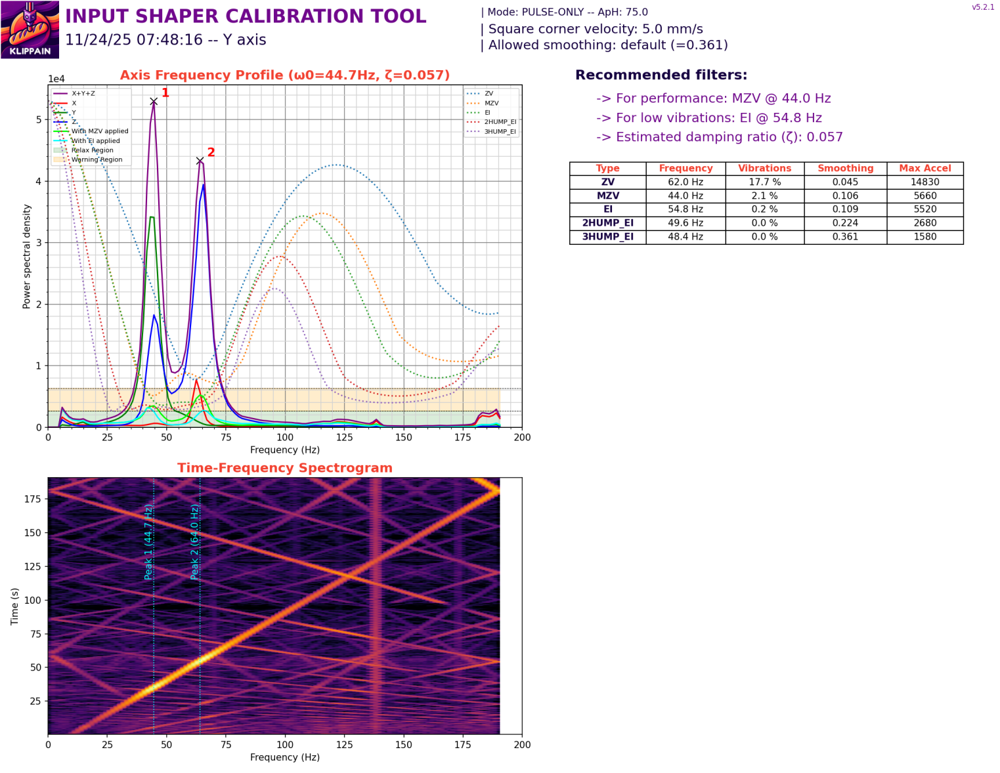
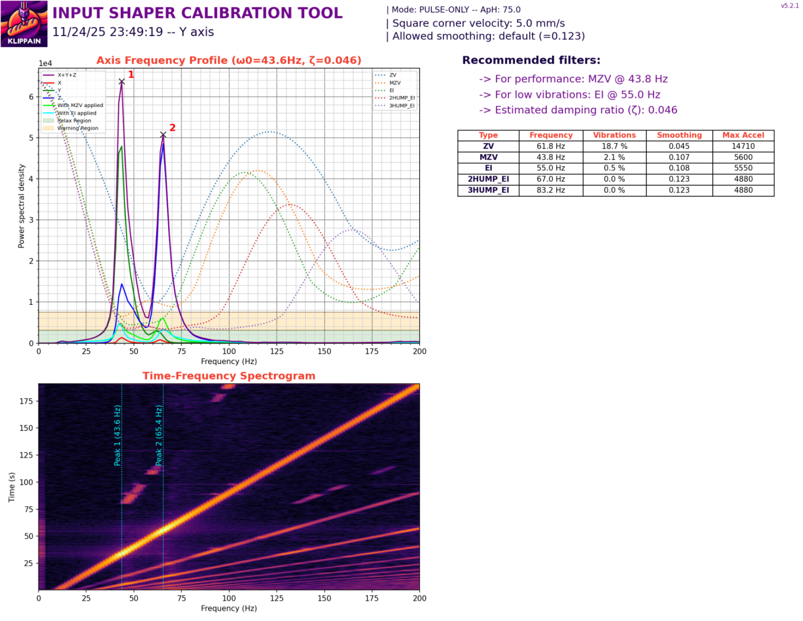

# Enhanced Klipper Firmware for Sovol Zero

This repository provides an improved, community-maintained Klipper fork for the **Sovol Zero**.  
It preserves the original Sovol firmware history while adding upstream backports, sensor fixes, and general improvements.

## Features & Improvements

### ✔ Backported LIS2DW Accelerometer Handling
This firmware includes an updated LIS2DW implementation backported from mainline Klipper.

The improvement:
- reads the LIS2DW FIFO **in chunks** instead of single-frame reads
- reduces sampling noise and jitter
- removes data gaps at the end of captured resonance traces
- produces cleaner, more stable input shaper measurements

The original problem is explained here:  
➡ **YouTube:** https://www.youtube.com/watch?v=IlrOraPmOHw

### ✔ Clean Development Tree
- Restored a proper `.gitignore`
- Removed OEM-generated artifacts (`.pyc`, build outputs, IDE caches)
- Ensured a reproducible development environment

### ✔ Full Original Sovol Firmware History Retained
The Sovol-provided firmware history was preserved in full to maintain transparency and GPL compliance.

---

## Before / After (Input Shaper Comparison)
**Screenshots credit:** Input shaper comparison images were kindly provided by **Atomique13** on the Klipper/Discord community.  
Used with permission - thank you very much.

### Before (OEM LIS2DW Handling)
High noise floor and missing samples at the end of the captured trace.

### After (Chunked FIFO Read Backport)
Cleaner signal, reduced jitter, and no gaps at the end of the resonance graph.

Observed improvements:
- reduced noise floor
- stable measurement envelope
- no missing samples at graph boundaries
- more accurate shaper frequency detection

---

## Building the Firmware (Important!)

The Sovol Zero uses a non-standard configuration and requires **specific build flags** and board particulars.

➡ **Follow this guide for building Klipper for the Sovol Zero:**  
https://github.com/vvuk/printer-configs/wiki/Kalico-on-the-Sovol-Zero/

This guide documents:
- the correct MCU target
- required board offsets
- flash layout
- quirks of the OEM firmware environment
- USB/serial considerations

⚠ **Do not follow the generic Klipper build guide — the Sovol Zero requires the custom procedure above.**

---

## Scope & Goals

- Provide upstream features that are missing in Sovol’s OEM firmware
- Improve sensor accuracy and reliability
- Fix OEM behaviour without diverging from Klipper architecture
- Keep compatibility with Klipper tooling (Mainsail, Fluidd, Moonraker)

Planned or possible future improvements:
- Eddy probe refinements
- input shaping consistency fixes
- MCU configuration cleanup
- additional sensor support

---

## Disclaimer

This is **unofficial firmware**.  
Sovol is **not** affiliated with or responsible for this project.  
Use at your own risk.

---

## License

All files are provided under the **GNU GPLv3**, as required by Klipper.  
OEM modifications are included unmodified where extracted from the device.

